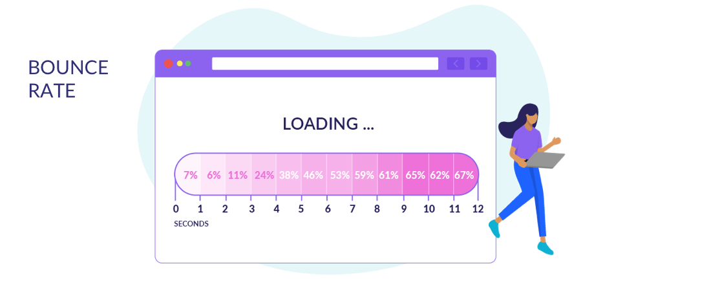
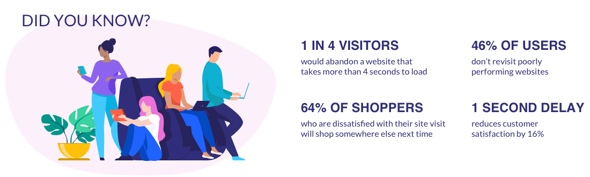

De fleste har prøvet at åbne en hjeemside som er tydeligvis ikke er flot eller nem at finde rundt på. men hvordan kan man måle hvor god en hjemmeside er?

Google har udviklet et redskab der hedder "Lighthouse" til at analysere hjemmesider. Lighthouse kan så kigge på din hjemmeside og fortælle dig hvor godt siden præstere og hvad der skal til for at forbedre siden. 

## Hvorfor er det vigtigt at optimere sin hjemmesides "Performance"?
Der er lavet masser af undersøgelser der viser at det er en rigtig god ide at have en hjemmeside der performer. Når jeg her skriver performer så kan det det næsten direkte oversættes til, at din hjemmeside skal være hurtig. 

Når vi så taler om hvor hurtig den er så er der ofte tre ting du kigger efter. 

1. Hvor hurtigt kan du se der sker noget.
2. Hvornår er der meningsfyldt indhold på skærmen.
3. Hvornår kan du bruge hjemmeside.

Hver af de tre tider er relevante for om nruger bliver på hjemmesiden eller smutter igen. Hvor mange der forlader siden med det samme, beskriver man ofte som Bounce rate. Altså hviklen rate af besøgendende forlader siden før den er loadet færdig. 6% af brugerne der venter 1 sekund forlader siden før den er loaded. Men lader du dine brugere vente bare 4 sekunder er det tal steget til 24%.

kilde: [websitebuilderexpert](https://www.websitebuilderexpert.com/building-websites/website-load-time-statistics/)

Så der kan vidst ikke herske nogen tvivl om at hurtige loading tider hjælper med at holde på besøgende. For lige at slå pointen helt hjem så skal man også huske på at næsten halvdelen af brugere ikke kommer tilbage til en hjemmeside der ikke perfomer godt.

kilde: [websitebuilderexpert](https://www.websitebuilderexpert.com/building-websites/website-load-time-statistics/)

## Hvad betyder de tal jeg får fra analysen?

## Sådan laver du selv en analyse

